<div align="center">
  

<div align="center">
  
  <h1>Python Text Editor App 📝</h1>
  
  <p>
    <i>A Professional Code Editing Solution: From Simple <strong>File Manager</strong> To Advanced <strong>IDE-Style Editor</strong>, Dark Mode Support, Sidebar Navigation, And Real-Time Syntax Highlighting.</i>
  </p>

  <p>
    <a href="#-about-the-project">About</a> •
    <a href="#-tech-stack--tools">Tech Stack</a> •
    <a href="#-gallery--demo">Gallery</a> •
    <a href="#-features--evolution">Evolution</a> •
    <a href="#-installation--usage">How To Run</a> •
    <a href="#-warnings--troubleshooting">Warnings</a>
  </p>
</div>

<br>

<br>

<h2 align="center" id="-about-the-project">About The Project </h2>

<div align="center">
  <p>
    <i>This Repository Represents The <strong>Sixth Major Milestone</strong> In My <strong>Front-End Diploma (Programming Fundamentals Track)</strong>.</i>
  </p>
  <p>
    <i>It's More Than Just An Editor, It's A Documentation Of My Journey In <strong>GUI Development & File Management Systems</strong> - The Project Chronicles The Evolution From Simple Text File Operations Using <strong>Basic Tkinter Widgets</strong> To A Sophisticated Code Editor Powered By <strong>Object-Oriented Design Patterns</strong> With IDE-Like Features.</i>
  </p>
  <p>
    <i>The Final Version Is An Intelligent Development Tool That Provides <strong>File Explorer Integration</strong>, Features A Modern <strong>Dark/Light Theme Toggle</strong>, Implements <strong>Keyboard Shortcuts</strong> For Power Users, Supports <strong>Multi-File Management</strong>, And Includes Smart Features Like <strong>Line/Column Tracking</strong>, Collapsible Sidebar, And Professional Menu System For Enhanced Productivity.</i>
  </p>
</div>

<br>

<br>

<h2 align="center" id="-tech-stack--tools">Tech Stack & Tools </h2>

<div align="center">
  
  
  
  
  
</div>

<br>

<div align="center">
  <p>
    • <strong>Python (3.10+):</strong> <i>The Core Language Driving All Application Logic, File Operations, And UI Management Systems.</i><br>
    • <strong>Tkinter GUI Framework:</strong> <i>Powers The Complete Visual Interface With Custom Widgets, Menu Systems, And Responsive Layout Design.</i><br>
    • <strong>Object-Oriented Programming:</strong> <i>Utilizes Class-Based Architecture With Methods For File Handling, Theme Management, And Event Processing.</i><br>
    • <strong>OS Module:</strong> <i>Handles File System Operations Including Directory Listing, File Creation, Deletion, And Path Management.</i><br>
    • <strong>File I/O Operations:</strong> <i>Manages Reading And Writing Text Files With UTF-8 Encoding Support For Multi-Language Content.</i><br>
    • <strong>Event-Driven Programming:</strong> <i>Implements Keyboard Shortcuts And Mouse Events For Seamless User Interaction And Navigation.</i><br>
    • <strong>Miro:</strong> <i>Used For Planning And Designing The Application Architecture, UI Layout, And Feature Flow Before Development.</i>
  </p>
</div>

<br>

<br>

<h2 align="center" id="-gallery--demo">Gallery & Demo </h2>

<div align="center">
  <i>The Project Followed A Structured "Plan-Then-Code" Approach - Below Is The Comparison Between The Planning Phase And The Final Execution For Both Versions.</i>
</div>
<br>

<table align="center" width="100%">
  <tr>
    <th style="text-align: center;" width="50%">Basic Version</th>
    <th style="text-align: center;" width="50%">Advanced Version</th>
  </tr>
  
  <tr>
    <td align="center">
      <strong>Planning (Logic)</strong><br><br>
      
    </td>
    <td align="center">
      <strong>Planning (Logic)</strong><br><br>
      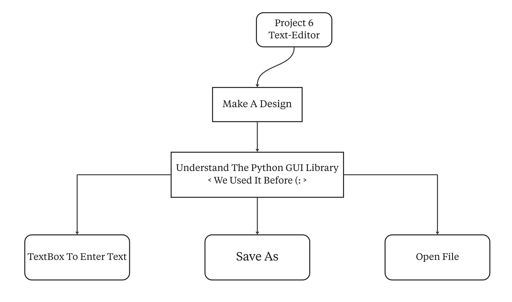
    </td>
  </tr>

  <tr>
    <td align="center" valign="top">
      <strong>Execution (Main Result)</strong><br><br>
      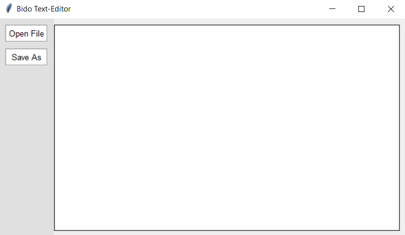
    </td>
    <td align="center" valign="top">
      <strong>Execution (Main Result)</strong><br><br>
      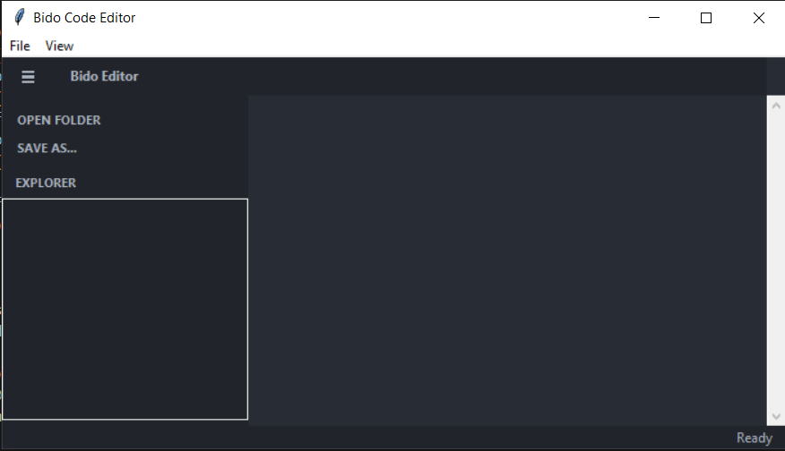
    </td>
  </tr>

  <tr>
    <td align="center" valign="top">
      <strong>UI Design</strong><br><br>
      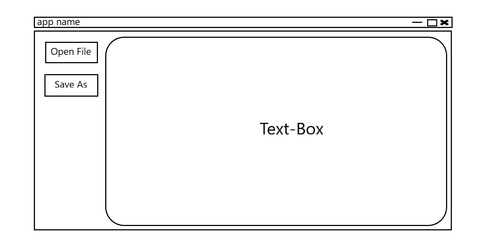
    </td>
    <td align="center" valign="top">
      <strong>UI Design</strong><br><br>
      
    </td>
  </tr>
</table>

<br>

<div align="center">
<details>
  <summary style="font-size: 1.2em; font-weight: bold; cursor: pointer;">View More Screenshots (Click Here) </summary>
  <br>
  
  <h3>Basic Version - Extra Shots</h3>
  <table align="center" width="100%">
    <tr>
      <td align="center" valign="middle" width="50%">
        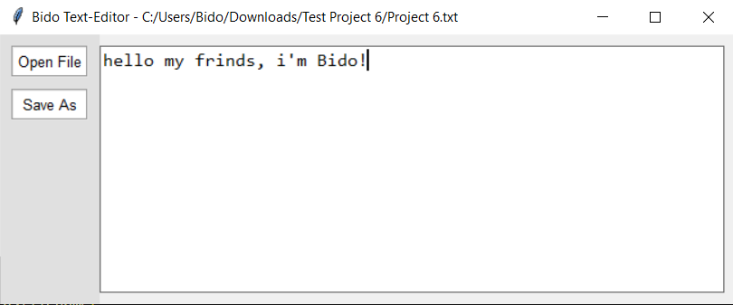
      </td>
      <td align="center" valign="middle" width="50%">
        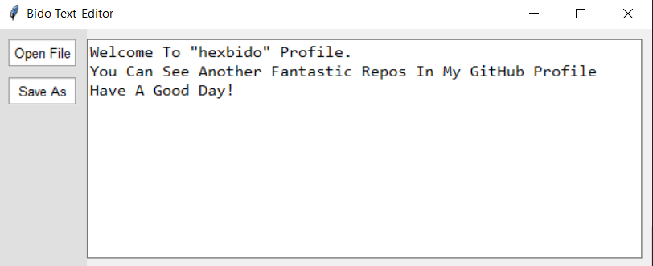
      </td>
    </tr>
  </table>
  
  <br><br><hr><br>
  
  <h3>Advanced Version - Extra Shots</h3>
  <table align="center" width="100%">
    <tr>
      <td align="center" valign="middle" width="50%">
        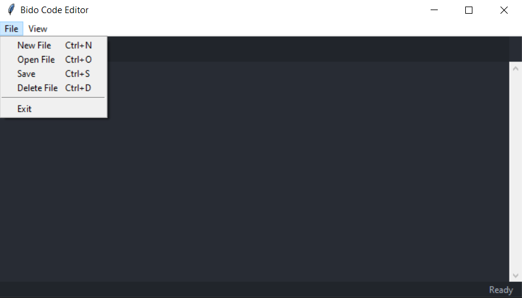
      </td>
      <td align="center" valign="middle" width="50%">
        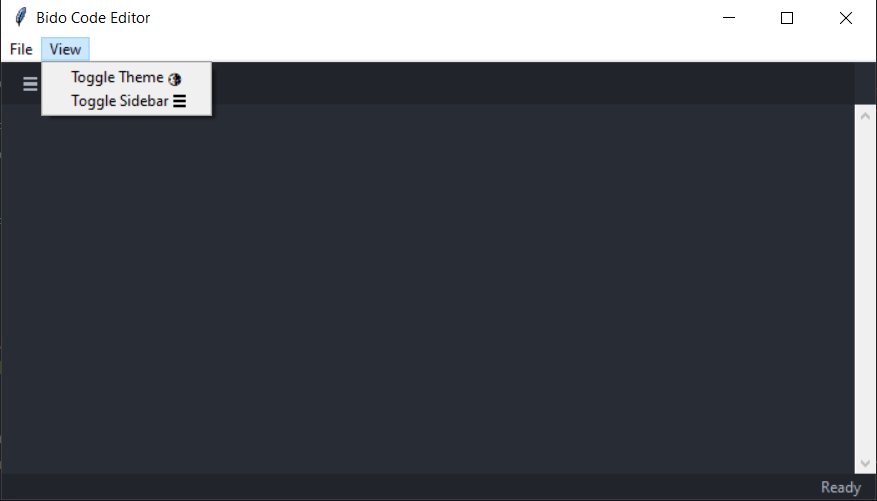
      </td>
    </tr>
  </table>
  
  <br>
  
  <table align="center" width="100%">
    <tr>
      <td align="center" valign="middle" width="50%">
        
      </td>
      <td align="center" valign="middle" width="50%">
        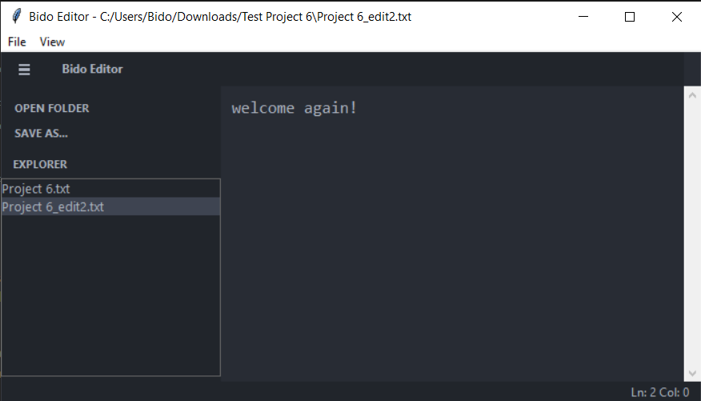
      </td>
    </tr>
  </table>
  
  <br>
  
  <table align="center" width="100%">
    <tr>
      <td align="center" valign="middle" width="50%">
        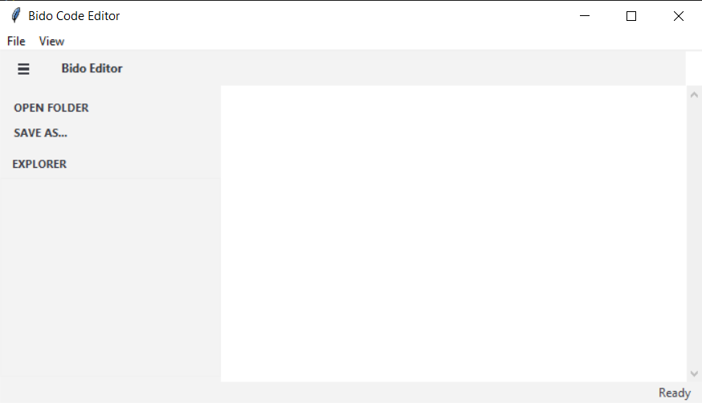
      </td>
      <td align="center" valign="middle" width="50%">
        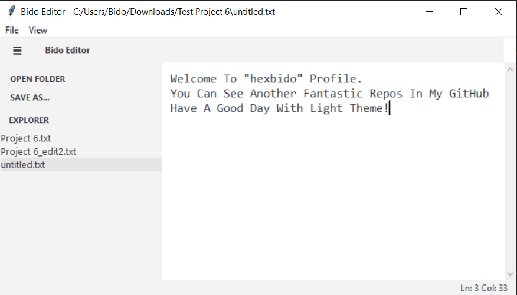
      </td>
    </tr>
  </table>
  
</details>
</div>

<br>

<div align="center">
  <h3>Live Demo </h3>
  <p><i>Watch The Application In Action: File Management, Theme Switching, And Real-Time Editing Features.</i></p>
  
  <a href="https://drive.google.com/file/d/147PGpHjyNiwLRcIxfIgdkVJ9H0Mtd2tE/view?usp=sharing" target="_blank">
    
    <br>
    <em>Click To Watch Video ▷</em>
  </a>
</div>

<br>

<br>

<h2 align="center" id="-features--evolution">Features & Evolution </h2>

<div align="center">
<i>The Transition From The Basic File Manager To The Advanced IDE-Style Editor Highlights A Significant Leap In Functionality And User Experience.</i>
</div>
<br>

<table align="center" style="border-collapse: collapse; width: 85%;">
  <thead>
    <tr>
      <th align="center" style="border: 1px solid #ddd; padding: 12px; text-align: center;"><strong>Feature</strong></th>
      <th align="center" style="border: 1px solid #ddd; padding: 12px; text-align: center;"><strong>Basic Version</strong></th>
      <th align="center" style="border: 1px solid #ddd; padding: 12px; text-align: center;"><strong>Advanced Version (IDE-Style)</strong></th>
    </tr>
  </thead>
  <tbody>
    <tr>
      <td align="center" style="border: 1px solid #ddd; padding: 10px;"><strong>Interface Design</strong></td>
      <td align="center" style="border: 1px solid #ddd; padding: 10px;">Simple Side Buttons</td>
      <td align="center" style="border: 1px solid #ddd; padding: 10px;"><strong>Full IDE Layout</strong> (Sidebar + Toolbar)</td>
    </tr>
    <tr>
      <td align="center" style="border: 1px solid #ddd; padding: 10px;"><strong>Theme Support</strong></td>
      <td align="center" style="border: 1px solid #ddd; padding: 10px;">Light Mode Only</td>
      <td align="center" style="border: 1px solid #ddd; padding: 10px;"><strong>Dark/Light Toggle</strong> (Live Switching)</td>
    </tr>
    <tr>
      <td align="center" style="border: 1px solid #ddd; padding: 10px;"><strong>File Management</strong></td>
      <td align="center" style="border: 1px solid #ddd; padding: 10px;">Open/Save Only</td>
      <td align="center" style="border: 1px solid #ddd; padding: 10px;"><strong>Create/Delete/Browse</strong> + Explorer</td>
    </tr>
    <tr>
      <td align="center" style="border: 1px solid #ddd; padding: 10px;"><strong>Navigation</strong></td>
      <td align="center" style="border: 1px solid #ddd; padding: 10px;">Manual File Selection</td>
      <td align="center" style="border: 1px solid #ddd; padding: 10px;"><strong>Directory Listing</strong> & Quick Access</td>
    </tr>
    <tr>
      <td align="center" style="border: 1px solid #ddd; padding: 10px;"><strong>Code Structure</strong></td>
      <td align="center" style="border: 1px solid #ddd; padding: 10px;">Procedural Programming</td>
      <td align="center" style="border: 1px solid #ddd; padding: 10px;"><strong>Object-Oriented</strong> (Class-Based)</td>
    </tr>
    <tr>
      <td align="center" style="border: 1px solid #ddd; padding: 10px;"><strong>Keyboard Shortcuts</strong></td>
      <td align="center" style="border: 1px solid #ddd; padding: 10px;">Not Available</td>
      <td align="center" style="border: 1px solid #ddd; padding: 10px;"><strong>Ctrl+N/O/S/D</strong> Support</td>
    </tr>
    <tr>
      <td align="center" style="border: 1px solid #ddd; padding: 10px;"><strong>Status Bar</strong></td>
      <td align="center" style="border: 1px solid #ddd; padding: 10px;">No Status Info</td>
      <td align="center" style="border: 1px solid #ddd; padding: 10px;"><strong>Live Line/Column</strong> Tracking</td>
    </tr>
  </tbody>
</table>

<br>

<div align="center">
  <h3>Key Features In Advanced Version </h3>
  <p>
    • <i><strong>Professional IDE Layout:</strong> Features A Complete Development Environment With <strong>Collapsible Sidebar</strong>, Top Toolbar, And Main Editing Area For Maximum Productivity.</i><br>
    • <i><strong>Dark/Light Theme Toggle:</strong> Switch Between <strong>Dark Mode (#282c34)</strong> And <strong>Light Mode (White)</strong> Instantly With Smart Color Management System.</i><br>
    • <i><strong>File Explorer Integration:</strong> Browse And Open Files From Any Directory With <strong>Listbox Navigation</strong> And Double-Click To Open Functionality.</i><br>
    • <i><strong>Advanced File Operations:</strong> Create New Files, Delete Existing Ones, Save As Any Format, And Manage Your Entire Project From Within The Editor.</i><br>
    • <i><strong>Keyboard Shortcuts:</strong> Speed Up Your Workflow With <strong>Ctrl+N (New)</strong>, <strong>Ctrl+O (Open)</strong>, <strong>Ctrl+S (Save)</strong>, And <strong>Ctrl+D (Delete)</strong>.</i><br>
    • <i><strong>Real-Time Status Tracking:</strong> Monitor Your Cursor Position With Live <strong>Line And Column Numbers</strong> Displayed In The Bottom Status Bar.</i><br>
    • <i><strong>Smart UI Elements:</strong> Includes Menu Bar, Toolbar Buttons, Scrollbar, And Professional Font Rendering With <strong>Consolas 13pt</strong> For Code Readability.</i><br>
    • <i><strong>Undo/Redo Support:</strong> Built-In Text Widget Features Allow You To Revert Changes And Maintain Editing History Throughout Your Session.</i>
  </p>
</div>

<br>

<br>

<h2 align="center" id="-installation--usage">Installation & Usage </h2>

<div align="center">
  <i>Follow The Steps Below To Run The Project Locally On Your Machine - Ensure You Have <strong>Python 3.10+</strong> Installed.</i>
</div>

<br>

<div align="center">
  <h3>1️⃣ Clone The Repository</h3>
  <i>Open Your Terminal And Run The Following Command To Download The Project Files:</i>
</div>

```bash
git clone https://github.com/hexbido/Text-Editor-App.git
cd Text-Editor-App
```

<br>

<div align="center">
  <h3>2️⃣ No External Dependencies Required</h3>
  <i>This Project Uses Only Python's Built-In Libraries (tkinter, os, filedialog, messagebox). No Additional Packages Need To Be Installed!</i>
</div>

<br>

<div align="center">
  <h3>3️⃣ Run The Basic Version</h3>
  <i>Navigate To The Basic Version Folder And Execute The Simple Text Editor:</i> 
</div>

```bash
cd Basic-Version
python Text_Editor.py
```

<br>

<div align="center">
  <h3>4️⃣ Run The Advanced Version (IDE-Style)</h3>
  <i>To Launch The Full Application With All Advanced Features:</i> 
</div>

```bash
cd Advanced-Version
python Text_Editor_AI.py
```

<br>

<div align="center">
  <h3>5️⃣ Using The Application</h3>
  <i>Follow These Simple Steps To Edit Files And Manage Your Projects:</i>
</div>

<div align="center">
  <p>
    • <strong>Opening Files:</strong> <i>Click <strong>File → Open</strong> Or Press <strong>Ctrl+O</strong> To Browse And Select Any Text File From Your System.</i><br>
    • <strong>Creating New Files:</strong> <i>Press <strong>Ctrl+N</strong> Or Use The Menu To Create A New Untitled File In The Current Directory.</i><br>
    • <strong>Saving Your Work:</strong> <i>Click <strong>File → Save</strong> Or Press <strong>Ctrl+S</strong> To Save Changes To Your Current File Or Save As A New File.</i><br>
    • <strong>Switching Themes:</strong> <i>Go To <strong>View → Toggle Theme 🌗</strong> To Switch Between Dark And Light Modes Instantly.</i><br>
    • <strong>Using The Sidebar:</strong> <i>Click <strong>OPEN FOLDER</strong> To Load A Directory, Then Double-Click Any File In The Explorer To Open It.</i><br>
    • <strong>Deleting Files:</strong> <i>Select A File From The Sidebar And Press <strong>Ctrl+D</strong> To Delete It (Confirmation Required).</i><br>
    • <strong>Collapsing Sidebar:</strong> <i>Click The <strong>☰</strong> Button Or Use <strong>View → Toggle Sidebar</strong> To Show/Hide The File Explorer.</i>
  </p>
</div>

<br>

<br>

<h2 align="center" id="-warnings--troubleshooting">Warnings & Troubleshooting </h2>

<div align="center">
  <p><i>Please Review The Following Notes To Ensure Smooth Operation And Avoid Common Issues:</i></p>
  
  <p>
    • <strong>Tkinter Installation:</strong> <i>Tkinter Comes Pre-Installed With Python On Most Systems. On Linux, Install With: <code>sudo apt-get install python3-tk</code></i><br><br>
    • <strong>File Permissions:</strong> <i>Ensure You Have Read/Write Permissions In The Directory Where You're Working - The App Needs Access To Create And Delete Files.</i><br><br>
    • <strong>File Encoding:</strong> <i>The Editor Uses <strong>UTF-8 Encoding</strong> By Default - Files With Different Encodings May Display Incorrectly Or Cause Read Errors.</i><br><br>
    • <strong>Large Files Warning:</strong> <i>The Text Widget May Become Slow With Files Larger Than <strong>10MB</strong> - Consider Using Specialized Tools For Very Large Files.</i><br><br>
    • <strong>Delete Confirmation:</strong> <i>When Deleting Files With <strong>Ctrl+D</strong>, Always Confirm The Action - <strong>Deleted Files Cannot Be Recovered</strong> From The App.</i><br><br>
    • <strong>Unsaved Changes:</strong> <i>The App <strong>Does Not Auto-Save</strong> Your Work - Remember To Manually Save Using <strong>Ctrl+S</strong> Before Closing Files.</i><br><br>
    • <strong>Directory Access:</strong> <i>When Using <strong>OPEN FOLDER</strong>, Ensure The Selected Directory Contains Text Files - Empty Folders Will Show An Empty Explorer.</i><br><br>
    • <strong>Theme Persistence:</strong> <i>Theme Preference Is <strong>Not Saved</strong> Between Sessions - The App Always Starts In Dark Mode By Default.</i>
  </p>
</div>

<br>

<div align="center">
  <p><i>Made With  By <a href="https://github.com/hexbido">B I D O</a></i></p>
</div>

